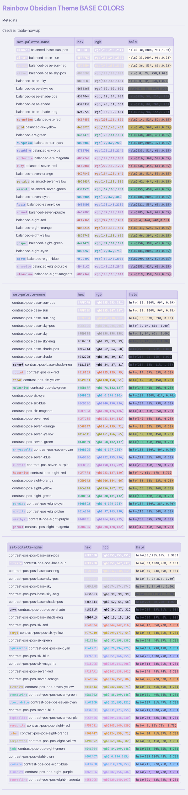
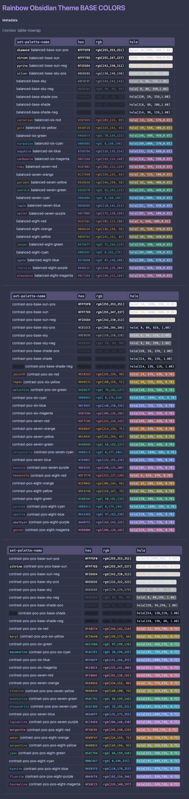

# Rainbow Obsidian Theme

## Coming Soon

**Rainbow Obsidian** theme for the [Obsidian.md](https://Obsidian.md) note-taking application.

Colors inspired by the [Penumbra Color Theme](https://github.com/nealmckee/penumbra)

## Sneak Preview

> coming soon

## Palettes

---

---

| `set-palette-name`                                                           | `hex`                                        | `rgb`                                                         | `hsla`                                                                                   |
| ---------------------------------------------------------------------------- | -------------------------------------------- | ------------------------------------------------------------- | ---------------------------------------------------------------------------------------- |
| <code style="color:var(--diamond)">diamond</code> balanced-base-sun-pos      | <code style="color:#FFFDFB;">\#FFFDFB</code> | <code style="color:rgb(255,253,251);">rgb(255,253,251)</code> | <code style="background-color:hsla( 30,100%, 99%,1.00);">hsla( 30,100%, 99%,1.00)</code> |
| <code style="color:var(--zircon)">zircon</code> balanced-base-sun            | <code style="color:#FFF7ED;">\#FFF7ED</code> | <code style="color:rgb(255,247,237);">rgb(255,247,237)</code> | <code style="background-color:hsla( 33,100%, 96%,0.98);">hsla( 33,100%, 96%,0.98)</code> |
| <code style="color:var(--pyrite)">pyrite</code> balanced-base-sun-neg        | <code style="color:#F2E6D4;">\#F2E6D4</code> | <code style="color:rgb(242,230,212);">rgb(242,230,212)</code> | <code style="background-color:hsla( 36, 53%, 89%,0.93);">hsla( 36, 53%, 89%,0.93)</code> |
| <code style="color:var(--silver)">silver</code> balanced-base-sky-pos        | <code style="color:#BEBEBE;">\#BEBEBE</code> | <code style="color:rgb(190,190,190);">rgb(190,190,190)</code> | <code style="background-color:hsla(  0,  0%, 75%,1.00);">hsla(  0,  0%, 75%,1.00)</code> |
| balanced-base-sky                                                            | <code style="color:#8F8F8F;">\#8F8F8F</code> | <code style="color:rgb(143,143,143);">rgb(143,143,143)</code> | <code style="background-color:hsla(  0,  0%, 56%,1.00);">hsla(  0,  0%, 56%,1.00)</code> |
| balanced-base-sky-neg                                                        | <code style="color:#636363;">\#636363</code> | <code style="color:rgb( 99, 99, 99);">rgb( 99, 99, 99)</code> | <code style="background-color:hsla(  0,  0%, 39%,1.00);">hsla(  0,  0%, 39%,1.00)</code> |
| balanced-base-shade-pos                                                      | <code style="color:#3E4044;">\#3E4044</code> | <code style="color:rgb( 62, 64, 68);">rgb( 62, 64, 68)</code> | <code style="background-color:hsla(220,  5%, 25%,1.00);">hsla(220,  5%, 25%,1.00)</code> |
| balanced-base-shade                                                          | <code style="color:#303338;">\#303338</code> | <code style="color:rgb( 48, 51, 56);">rgb( 48, 51, 56)</code> | <code style="background-color:hsla(218,  8%, 20%,1.00);">hsla(218,  8%, 20%,1.00)</code> |
| balanced-base-shade-neg                                                      | <code style="color:#24272B;">\#24272B</code> | <code style="color:rgb( 36, 39, 43);">rgb( 36, 39, 43)</code> | <code style="background-color:hsla(214,  9%, 15%,1.00);">hsla(214,  9%, 15%,1.00)</code> |
| <code style="color:var(--carnelian)">carnelian</code> balanced-six-red       | <code style="color:#CB7459;">\#CB7459</code> | <code style="color:rgb(203,116, 89);">rgb(203,116, 89)</code> | <code style="background-color:hsla( 14, 52%, 57%,0.65);">hsla( 14, 52%, 57%,0.65)</code> |
| <code style="color:var(--gold)">gold</code> balanced-six-yellow              | <code style="color:#A38F2D;">\#A38F2D</code> | <code style="color:rgb(163,143, 45);">rgb(163,143, 45)</code> | <code style="background-color:hsla( 49, 56%, 40%,0.65);">hsla( 49, 56%, 40%,0.65)</code> |
| balanced-six-green                                                           | <code style="color:#46A473;">\#46A473</code> | <code style="color:rgb( 70,164,115);">rgb( 70,164,115)</code> | <code style="background-color:hsla(148, 40%, 45%,0.65);">hsla(148, 40%, 45%,0.65)</code> |
| <code style="color:var(--turquoise)">turquoise</code> balanced-six-cyan      | <code style="color:#00A0BE;">\#00A0BE</code> | <code style="color:rgb(  0,160,190);">rgb(  0,160,190)</code> | <code style="background-color:hsla(189,100%, 37%,0.65);">hsla(189,100%, 37%,0.65)</code> |
| <code style="color:var(--sapphire)">sapphire</code> balanced-six-blue        | <code style="color:#7E87D6;">\#7E87D6</code> | <code style="color:rgb(126,135,214);">rgb(126,135,214)</code> | <code style="background-color:hsla(233, 51%, 66%,0.65);">hsla(233, 51%, 66%,0.65)</code> |
| <code style="color:var(--carbuncle)">carbuncle</code> balanced-six-magenta   | <code style="color:#BD72A8;">\#BD72A8</code> | <code style="color:rgb(189,114,168);">rgb(189,114,168)</code> | <code style="background-color:hsla(316, 36%, 59%,0.65);">hsla(316, 36%, 59%,0.65)</code> |
| <code style="color:var(--ruby)">ruby</code> balanced-seven-red               | <code style="color:#CA7081;">\#CA7081</code> | <code style="color:rgb(202,112,129);">rgb(202,112,129)</code> | <code style="background-color:hsla(348, 45%, 61%,0.65);">hsla(348, 45%, 61%,0.65)</code> |
| balanced-seven-orange                                                        | <code style="color:#C27D40;">\#C27D40</code> | <code style="color:rgb(194,125, 64);">rgb(194,125, 64)</code> | <code style="background-color:hsla( 28, 51%, 50%,0.65);">hsla( 28, 51%, 50%,0.65)</code> |
| <code style="color:var(--peridot)">peridot</code> balanced-seven-yellow      | <code style="color:#92963A;">\#92963A</code> | <code style="color:rgb(146,150, 58);">rgb(146,150, 58)</code> | <code style="background-color:hsla( 62, 44%, 40%,0.65);">hsla( 62, 44%, 40%,0.65)</code> |
| <code style="color:var(--emerald)">emerald</code> balanced-seven-green       | <code style="color:#3EA57B;">\#3EA57B</code> | <code style="color:rgb( 62,165,123);">rgb( 62,165,123)</code> | <code style="background-color:hsla(155, 45%, 44%,0.65);">hsla(155, 45%, 44%,0.65)</code> |
| balanced-seven-cyan                                                          | <code style="color:#00A0BA;">\#00A0BA</code> | <code style="color:rgb(  0,160,186);">rgb(  0,160,186)</code> | <code style="background-color:hsla(188,100%, 36%,0.65);">hsla(188,100%, 36%,0.65)</code> |
| <code style="color:var(--lapis)">lapis</code> balanced-seven-blue            | <code style="color:#6E8DD5;">\#6E8DD5</code> | <code style="color:rgb(110,141,213);">rgb(110,141,213)</code> | <code style="background-color:hsla(221, 55%, 63%,0.65);">hsla(221, 55%, 63%,0.65)</code> |
| <code style="color:var(--spinel)">spinel</code> balanced-seven-purple        | <code style="color:#AC78BD;">\#AC78BD</code> | <code style="color:rgb(172,120,189);">rgb(172,120,189)</code> | <code style="background-color:hsla(285, 34%, 60%,0.65);">hsla(285, 34%, 60%,0.65)</code> |
| balanced-eight-red                                                           | <code style="color:#CA736C;">\#CA736C</code> | <code style="color:rgb(202,115,108);">rgb(202,115,108)</code> | <code style="background-color:hsla(  4, 46%, 60%,0.65);">hsla(  4, 46%, 60%,0.65)</code> |
| balanced-eight-orange                                                        | <code style="color:#BA823A;">\#BA823A</code> | <code style="color:rgb(186,130, 58);">rgb(186,130, 58)</code> | <code style="background-color:hsla( 33, 52%, 47%,0.65);">hsla( 33, 52%, 47%,0.65)</code> |
| balanced-eight-yellow                                                        | <code style="color:#8D9741;">\#8D9741</code> | <code style="color:rgb(141,151, 65);">rgb(141,151, 65)</code> | <code style="background-color:hsla( 66, 39%, 42%,0.65);">hsla( 66, 39%, 42%,0.65)</code> |
| <code style="color:var(--jasper)">jasper</code> balanced-eight-green         | <code style="color:#47A477;">\#47A477</code> | <code style="color:rgb( 71,164,119);">rgb( 71,164,119)</code> | <code style="background-color:hsla(150, 39%, 46%,0.65);">hsla(150, 39%, 46%,0.65)</code> |
| balanced-eight-cyan                                                          | <code style="color:#00A2AF;">\#00A2AF</code> | <code style="color:rgb(  0,162,175);">rgb(  0,162,175)</code> | <code style="background-color:hsla(184,100%, 34%,0.65);">hsla(184,100%, 34%,0.65)</code> |
| <code style="color:var(--agate)">agate</code> balanced-eight-blue            | <code style="color:#5794D0;">\#5794D0</code> | <code style="color:rgb( 87,148,208);">rgb( 87,148,208)</code> | <code style="background-color:hsla(209, 56%, 57%,0.65);">hsla(209, 56%, 57%,0.65)</code> |
| <code style="color:var(--charoite)">charoite</code> balanced-eight-purple    | <code style="color:#9481CC;">\#9481CC</code> | <code style="color:rgb(148,129,204);">rgb(148,129,204)</code> | <code style="background-color:hsla(255, 42%, 65%,0.65);">hsla(255, 42%, 65%,0.65)</code> |
| <code style="color:var(--almandine)">almandine</code> balanced-eight-magenta | <code style="color:#BC73A4;">\#BC73A4</code> | <code style="color:rgb(188,115,164);">rgb(188,115,164)</code> | <code style="background-color:hsla(319, 35%, 59%,0.65);">hsla(319, 35%, 59%,0.65)</code> |

---

| `set-palette-name`                                                                | `hex`                                        | `rgb`                                                         | `hsla`                                                                                       |
| --------------------------------------------------------------------------------- | -------------------------------------------- | ------------------------------------------------------------- | -------------------------------------------------------------------------------------------- |
| contrast-pos-base-sun-pos                                                         | <code style="color:#FFFDFB;">\#FFFDFB</code> | <code style="color:rgb(255,253,251);">rgb(255,253,251)</code> | <code style="background-color:hsla( 30, 100%, 99%, 0.99);">hsla( 30, 100%, 99%, 0.99)</code> |
| contrast-pos-base-sun                                                             | <code style="color:#FFF7ED;">\#FFF7ED</code> | <code style="color:rgb(255,247,237);">rgb(255,247,237)</code> | <code style="background-color:hsla( 33, 100%, 96%, 0.98);">hsla( 33, 100%, 96%, 0.98)</code> |
| contrast-pos-base-sun-neg                                                         | <code style="color:#F2E6D4;">\#F2E6D4</code> | <code style="color:rgb(242,230,212);">rgb(242,230,212)</code> | <code style="background-color:hsla( 36,  53%, 89%, 0.93);">hsla( 36,  53%, 89%, 0.93)</code> |
| contrast-pos-base-sky-pos                                                         | <code style="color:#CECECE;">\#CECECE</code> | <code style="color:rgb(206,206,206);">rgb(206,206,206)</code> | <code style="background-color:hsla(  0,   0%, 81%, 1,00);">hsla(  0,   0%, 81%, 1,00)</code> |
| contrast-pos-base-sky                                                             | <code style="color:#9E9E9E;">\#9E9E9E</code> | <code style="color:rgb(158,158,158);">rgb(158,158,158)</code> | <code style="background-color:hsla(  0,   0%, 62%, 1.00);">hsla(  0,   0%, 62%, 1.00)</code> |
| contrast-pos-base-sky-neg                                                         | <code style="color:#636363;">\#636363</code> | <code style="color:rgb( 99, 99, 99);">rgb( 99, 99, 99)</code> | <code style="background-color:hsla(  0,   0%, 39%, 1.00);">hsla(  0,   0%, 39%, 1.00)</code> |
| contrast-pos-base-shade-pos                                                       | <code style="color:#3E4044;">\#3E4044</code> | <code style="color:rgb( 62, 64, 68);">rgb( 62, 64, 68)</code> | <code style="background-color:hsla(220,   5%, 25%, 1.00);">hsla(220,   5%, 25%, 1.00)</code> |
| contrast-pos-base-shade                                                           | <code style="color:#24272B;">\#24272B</code> | <code style="color:rgb( 36, 39, 43);">rgb( 36, 39, 43)</code> | <code style="background-color:hsla(214,   9%, 15%, 1.00);">hsla(214,   9%, 15%, 1.00)</code> |
| <code style="color:var(--schorl)">schorl</code> contrast-pos-base-shade-neg       | <code style="color:#181B1F;">\#181B1F</code> | <code style="color:rgb( 24, 27, 31);">rgb( 24, 27, 31)</code> | <code style="background-color:hsla(214,  13%, 11%, 1.00);">hsla(214,  13%, 11%, 1.00)</code> |
| <code style="color:var(--jacinth)">jacinth</code> contrast-pos-six-red            | <code style="color:#E18163;">\#E18163</code> | <code style="color:rgb(225,129, 99);">rgb(225,129, 99)</code> | <code style="background-color:hsla( 14,  67%, 63%, 0.70);">hsla( 14,  67%, 63%, 0.70)</code> |
| <code style="color:var(--topaz)">topaz</code> contrast-pos-six-yellow             | <code style="color:#B49E33;">\#B49E33</code> | <code style="color:rgb(180,158, 51);">rgb(180,158, 51)</code> | <code style="background-color:hsla( 49,  55%, 45%, 0.70);">hsla( 49,  55%, 45%, 0.70)</code> |
| <code style="color:var(--malachite)">malachite</code> contrast-pos-six-green      | <code style="color:#4EB67F;">\#4EB67F</code> | <code style="color:rgb( 78,182,127);">rgb( 78,182,127)</code> | <code style="background-color:hsla(148,  41%, 50%, 0.70);">hsla(148,  41%, 50%, 0.70)</code> |
| contrast-pos-six-cyan                                                             | <code style="color:#00B0D2;">\#00B0D2</code> | <code style="color:rgb(  0,176,210);">rgb(  0,176,210)</code> | <code style="background-color:hsla(189, 100%, 41%, 0.70);">hsla(189, 100%, 41%, 0.70)</code> |
| contrast-pos-six-blue                                                             | <code style="color:#8C96EC;">\#8C96EC</code> | <code style="color:rgb(140,150,236);">rgb(140,150,236)</code> | <code style="background-color:hsla(233,  71%, 73%, 0.70);">hsla(233,  71%, 73%, 0.70)</code> |
| contrast-pos-six-magenta                                                          | <code style="color:#D07EBA;">\#D07EBA</code> | <code style="color:rgb(208,126,186);">rgb(208,126,186)</code> | <code style="background-color:hsla(316,  46%, 65%, 0.70);">hsla(316,  46%, 65%, 0.70)</code> |
| contrast-pos-seven-red                                                            | <code style="color:#DF7C8E;">\#DF7C8E</code> | <code style="color:rgb(223,124,142);">rgb(223,124,142)</code> | <code style="background-color:hsla(349,  60%, 68%, 0.70);">hsla(349,  60%, 68%, 0.70)</code> |
| contrast-pos-seven-orange                                                         | <code style="color:#D68B47;">\#D68B47</code> | <code style="color:rgb(214,139, 71);">rgb(214,139, 71)</code> | <code style="background-color:hsla( 28,  63%, 55%, 0.70);">hsla( 28,  63%, 55%, 0.70)</code> |
| contrast-pos-seven-yellow                                                         | <code style="color:#A1A641;">\#A1A641</code> | <code style="color:rgb(161,166, 65);">rgb(161,166, 65)</code> | <code style="background-color:hsla( 62,  43%, 45%, 0.70);">hsla( 62,  43%, 45%, 0.70)</code> |
| contrast-pos-seven-green                                                          | <code style="color:#44B689;">\#44B689</code> | <code style="color:rgb( 68,182,137);">rgb( 68,182,137)</code> | <code style="background-color:hsla(156,  45%, 49%, 0.70);">hsla(156,  45%, 49%, 0.70)</code> |
| <code style="color:var(--chrysocolla)">chrysocolla</code> contrast-pos-seven-cyan | <code style="color:#00B1CE;">\#00B1CE</code> | <code style="color:rgb(  0,177,206);">rgb(  0,177,206)</code> | <code style="background-color:hsla(188, 100%, 40%, 0.70);">hsla(188, 100%, 40%, 0.70)</code> |
| contrast-pos-seven-blue                                                           | <code style="color:#7A9BEC;">\#7A9BEC</code> | <code style="color:rgb(122,155,236);">rgb(122,155,236)</code> | <code style="background-color:hsla(222,  75%, 70%, 0.70);">hsla(222,  75%, 70%, 0.70)</code> |
| <code style="color:var(--kunzite)">kunzite</code> contrast-pos-seven-purple       | <code style="color:#BE85D1;">\#BE85D1</code> | <code style="color:rgb(190,133,209);">rgb(190,133,209)</code> | <code style="background-color:hsla(285,  45%, 67%, 0.70);">hsla(285,  45%, 67%, 0.70)</code> |
| <code style="color:var(--hessonite)">hessonite</code> contrast-pos-eight-red      | <code style="color:#DF7F78;">\#DF7F78</code> | <code style="color:rgb(223,127,120);">rgb(223,127,120)</code> | <code style="background-color:hsla(  4,  61%, 67%, 0.70);">hsla(  4,  61%, 67%, 0.70)</code> |
| contrast-pos-eight-orange                                                         | <code style="color:#CE9042;">\#CE9042</code> | <code style="color:rgb(206,144, 66);">rgb(206,144, 66)</code> | <code style="background-color:hsla( 33,  58%, 53%, 0.70);">hsla( 33,  58%, 53%, 0.70)</code> |
| contrast-pos-eight-yellow                                                         | <code style="color:#9CA748;">\#9CA748</code> | <code style="color:rgb(156,167, 72);">rgb(156,167, 72)</code> | <code style="background-color:hsla( 66,  39%, 46%, 0.70);">hsla( 66,  39%, 46%, 0.70)</code> |
| contrast-pos-eight-green                                                          | <code style="color:#50B584;">\#50B584</code> | <code style="color:rgb( 80,181,132);">rgb( 80,181,132)</code> | <code style="background-color:hsla(150,  40%, 51%, 0.70);">hsla(150,  40%, 51%, 0.70)</code> |
| <code style="color:var(--paraiba)">paraiba</code> contrast-pos-eight-cyan         | <code style="color:#00B3C2;">\#00B3C2</code> | <code style="color:rgb(  0,179,194);">rgb(  0,179,194)</code> | <code style="background-color:hsla(184, 100%, 38%, 0.70);">hsla(184, 100%, 38%, 0.70)</code> |
| <code style="color:var(--apatite)">apatite</code> contrast-pos-eight-blue         | <code style="color:#61A3E6;">\#61A3E6</code> | <code style="color:rgb( 97,163,230);">rgb( 97,163,230)</code> | <code style="background-color:hsla(210,  72%, 64%, 0.70);">hsla(210,  72%, 64%, 0.70)</code> |
| <code style="color:var(--amethyst)">amethyst</code> contrast-pos-eight-purple     | <code style="color:#A48FE1;">\#A48FE1</code> | <code style="color:rgb(164,143,225);">rgb(164,143,225)</code> | <code style="background-color:hsla(255,  57%, 72%, 0.70);">hsla(255,  57%, 72%, 0.70)</code> |
| <code style="color:var(--garnet)">garnet</code> contrast-pos-eight-magenta        | <code style="color:#D080B6;">\#D080B6</code> | <code style="color:rgb(208,128,182);">rgb(208,128,182)</code> | <code style="background-color:hsla(319,  45%, 65%, 0.70);">hsla(319,  45%, 65%, 0.70)</code> |

---

| `set-palette-name`                                                                     | `hex`                                        | `rgb`                                                         | `hsla`                                                                                   |
| -------------------------------------------------------------------------------------- | -------------------------------------------- | ------------------------------------------------------------- | ---------------------------------------------------------------------------------------- |
| contrast-pos-pos-base-sun-pos                                                          | <code style="color:#FFFDFB;">\#FFFDFB</code> | <code style="color:rgb(255,253,251);">rgb(255,253,251)</code> | <code style="background-color:hsla(30,100%,99%, 0.995);">hsla(30,100%,99%, 0.995)</code> |
| <code style="color:var(--citrine)">citrine</code> contrast-pos-pos-base-sun            | <code style="color:#FFF7ED;">\#FFF7ED</code> | <code style="color:rgb(255,247,237);">rgb(255,247,237)</code> | <code style="background-color:hsla( 33,100%,96%, 0.98);">hsla( 33,100%,96%, 0.98)</code> |
| contrast-pos-pos-base-sun-neg                                                          | <code style="color:#F2E6D4;">\#F2E6D4</code> | <code style="color:rgb(242,230,212);">rgb(242,230,212)</code> | <code style="background-color:hsla( 36, 53%,89%, 0.93);">hsla( 36, 53%,89%, 0.93)</code> |
| contrast-pos-pos-base-sky-pos                                                          | <code style="color:#DEDEDE;">\#DEDEDE</code> | <code style="color:rgb(222,222,222);">rgb(222,222,222)</code> | <code style="background-color:hsla(  0,  0%,87%, 1.00);">hsla(  0,  0%,87%, 1.00)</code> |
| contrast-pos-pos-base-sky                                                              | <code style="color:#AEAEAE;">\#AEAEAE</code> | <code style="color:rgb(174,174,174);">rgb(174,174,174)</code> | <code style="background-color:hsla(  0,  0%,68%, 1.00);">hsla(  0,  0%,68%, 1.00)</code> |
| contrast-pos-pos-base-sky-neg                                                          | <code style="color:#636363;">\#636363</code> | <code style="color:rgb( 99, 99, 99);">rgb( 99, 99, 99)</code> | <code style="background-color:hsla(  0,  0%,39%, 1.00);">hsla(  0,  0%,39%, 1.00)</code> |
| contrast-pos-pos-base-shade-pos                                                        | <code style="color:#3E4044;">\#3E4044</code> | <code style="color:rgb( 62, 64, 68);">rgb( 62, 64, 68)</code> | <code style="background-color:hsla(220,  5%,25%, 1.00);">hsla(220,  5%,25%, 1.00)</code> |
| <code style="color:var(--onyx)">onyx</code> contrast-pos-pos-base-shade                | <code style="color:#181B1F;">\#181B1F</code> | <code style="color:rgb( 24, 27, 31);">rgb( 24, 27, 31)</code> | <code style="background-color:hsla(214, 13%,11%, 1.00);">hsla(214, 13%,11%, 1.00)</code> |
| contrast-pos-pos-base-shade-neg                                                        | <code style="color:#0D0F13;">\#0D0F13</code> | <code style="color:rgb( 13, 15, 19);">rgb( 13, 15, 19)</code> | <code style="background-color:hsla(220, 19%, 6%, 1.00);">hsla(220, 19%, 6%, 1.00)</code> |
| contrast-pos-pos-six-red                                                               | <code style="color:#F48E74;">\#F48E74</code> | <code style="color:rgb(244,142,116);">rgb(244,142,116)</code> | <code style="background-color:hsla( 12, 85%,70%, 0.75);">hsla( 12, 85%,70%, 0.75)</code> |
| <code style="color:var(--beryl)">beryl</code> contrast-pos-pos-six-yellow              | <code style="color:#C7AD40;">\#C7AD40</code> | <code style="color:rgb(199,173, 64);">rgb(199,173, 64)</code> | <code style="background-color:hsla( 48, 54%,51%, 0.75);">hsla( 48, 54%,51%, 0.75)</code> |
| contrast-pos-pos-six-green                                                             | <code style="color:#61C68A;">\#61C68A</code> | <code style="color:rgb( 97,198,138);">rgb( 97,198,138)</code> | <code style="background-color:hsla(144, 46%,57%, 0.75);">hsla(144, 46%,57%, 0.75)</code> |
| <code style="color:var(--aquamarine)">aquamarine</code> contrast-pos-pos-six-cyan      | <code style="color:#1AC2E1;">\#1AC2E1</code> | <code style="color:rgb( 26,194,225);">rgb( 26,194,225)</code> | <code style="background-color:hsla(189, 79%,49%, 0.75);">hsla(189, 79%,49%, 0.75)</code> |
| contrast-pos-pos-six-blue                                                              | <code style="color:#97A6FF;">\#97A6FF</code> | <code style="color:rgb(151,166,255);">rgb(151,166,255)</code> | <code style="background-color:hsla(231,100%,79%, 0.75);">hsla(231,100%,79%, 0.75)</code> |
| contrast-pos-pos-six-magenta                                                           | <code style="color:#E18DCE;">\#E18DCE</code> | <code style="color:rgb(225,141,206);">rgb(225,141,206)</code> | <code style="background-color:hsla(313, 58%,71%, 0.75);">hsla(313, 58%,71%, 0.75)</code> |
| contrast-pos-pos-seven-red                                                             | <code style="color:#F18AA1;">\#F18AA1</code> | <code style="color:rgb(241,138,161);">rgb(241,138,161)</code> | <code style="background-color:hsla(346, 78%,74%, 0.75);">hsla(346, 78%,74%, 0.75)</code> |
| contrast-pos-pos-seven-orange                                                          | <code style="color:#EA9856;">\#EA9856</code> | <code style="color:rgb(234,152, 86);">rgb(234,152, 86)</code> | <code style="background-color:hsla( 26, 77%,62%, 0.75);">hsla( 26, 77%,62%, 0.75)</code> |
| <code style="color:var(--titanite)">titanite</code> contrast-pos-pos-seven-yellow      | <code style="color:#B4B44A;">\#B4B44A</code> | <code style="color:rgb(180,180, 74);">rgb(180,180, 74)</code> | <code style="background-color:hsla( 59, 41%,49%, 0.75);">hsla( 59, 41%,49%, 0.75)</code> |
| <code style="color:var(--aventurine)">aventurine</code> contrast-pos-pos-seven-green   | <code style="color:#58C792;">\#58C792</code> | <code style="color:rgb( 88,199,146);">rgb( 88,199,146)</code> | <code style="background-color:hsla(151, 49%,56%, 0.75);">hsla(151, 49%,56%, 0.75)</code> |
| <code style="color:var(--alexandrite)">alexandrite</code> contrast-pos-pos-seven-cyan  | <code style="color:#16C3DD;">\#16C3DD</code> | <code style="color:rgb( 22,195,221);">rgb( 22,195,221)</code> | <code style="background-color:hsla(187, 81%,47%, 0.75);">hsla(187, 81%,47%, 0.75)</code> |
| contrast-pos-pos-seven-blue                                                            | <code style="color:#83ADFF;">\#83ADFF</code> | <code style="color:rgb(131,173,255);">rgb(131,173,255)</code> | <code style="background-color:hsla(219,100%,75%, 0.75);">hsla(219,100%,75%, 0.75)</code> |
| <code style="color:var(--lepidolite)">lepidolite</code> contrast-pos-pos-seven-purple  | <code style="color:#CC94E6;">\#CC94E6</code> | <code style="color:rgb(204,148,230);">rgb(204,148,230)</code> | <code style="background-color:hsla(280, 62%,74%, 0.75);">hsla(280, 62%,74%, 0.75)</code> |
| <code style="color:var(--morganite)">morganite</code> contrast-pos-pos-eight-red       | <code style="color:#F58C81;">\#F58C81</code> | <code style="color:rgb(245,140,129);">rgb(245,140,129)</code> | <code style="background-color:hsla(  5, 85%,73%, 0.75);">hsla(  5, 85%,73%, 0.75)</code> |
| <code style="color:var(--amber)">amber</code> contrast-pos-pos-eight-orange            | <code style="color:#E09F47;">\#E09F47</code> | <code style="color:rgb(224,159, 71);">rgb(224,159, 71)</code> | <code style="background-color:hsla( 34, 71%,57%, 0.75);">hsla( 34, 71%,57%, 0.75)</code> |
| <code style="color:var(--serpentine)">serpentine</code> contrast-pos-pos-eight-yellow  | <code style="color:#A9B852;">\#A9B852</code> | <code style="color:rgb(169,184, 82);">rgb(169,184, 82)</code> | <code style="background-color:hsla( 68, 41%,52%, 0.75);">hsla( 68, 41%,52%, 0.75)</code> |
| <code style="color:var(--jade)">jade</code> contrast-pos-pos-eight-green               | <code style="color:#54C794;">\#54C794</code> | <code style="color:rgb( 84,199,148);">rgb( 84,199,148)</code> | <code style="background-color:hsla(153, 50%,55%, 0.75);">hsla(153, 50%,55%, 0.75)</code> |
| contrast-pos-pos-eight-cyan                                                            | <code style="color:#00C4D7;">\#00C4D7</code> | <code style="color:rgb(  0,196,215);">rgb(  0,196,215)</code> | <code style="background-color:hsla(185,100%,42%, 0.75);">hsla(185,100%,42%, 0.75)</code> |
| <code style="color:var(--kyanite)">kyanite</code> contrast-pos-pos-eight-blue          | <code style="color:#6EB2FD;">\#6EB2FD</code> | <code style="color:rgb(110,178,253);">rgb(110,178,253)</code> | <code style="background-color:hsla(211, 97%,71%, 0.75);">hsla(211, 97%,71%, 0.75)</code> |
| <code style="color:var(--fluorite)">fluorite</code> contrast-pos-pos-eight-purple      | <code style="color:#B69CF6;">\#B69CF6</code> | <code style="color:rgb(182,156,246);">rgb(182,156,246)</code> | <code style="background-color:hsla(257, 83%,78%, 0.75);">hsla(257, 83%,78%, 0.75)</code> |
| <code style="color:var(--tourmaline)">tourmaline</code> contrast-pos-pos-eight-magenta | <code style="color:#E58CC5;">\#E58CC5</code> | <code style="color:rgb(229,140,197);">rgb(229,140,197)</code> | <code style="background-color:hsla(321, 63%,72%, 0.75);">hsla(321, 63%,72%, 0.75)</code> |

